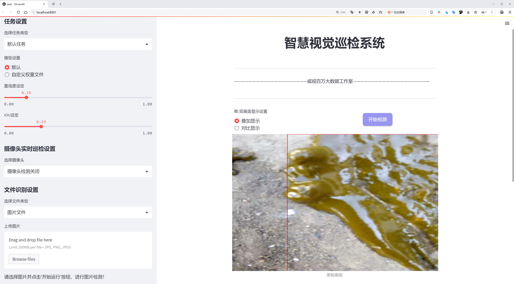

# 鸡粪疾病检测系统源码分享
 # [一条龙教学YOLOV8标注好的数据集一键训练_70+全套改进创新点发刊_Web前端展示]

### 1.研究背景与意义

项目参考[AAAI Association for the Advancement of Artificial Intelligence](https://gitee.com/qunmasj/projects)

项目来源[AACV Association for the Advancement of Computer Vision](https://kdocs.cn/l/cszuIiCKVNis)

研究背景与意义

随着全球农业生产的不断发展，家禽养殖业在满足人类日益增长的肉类需求方面发挥了重要作用。然而，鸡粪作为家禽养殖的副产品，其质量和安全性直接影响到养殖效益和生态环境。鸡粪中可能滋生多种病原体，导致家禽疾病的传播，进而影响到整个养殖链的健康。因此，及时、准确地检测鸡粪中的疾病迹象，对于保障家禽健康、提高养殖效率、降低经济损失具有重要意义。

近年来，计算机视觉技术的快速发展为农业领域的疾病检测提供了新的解决方案。特别是基于深度学习的目标检测算法，如YOLO（You Only Look Once），因其高效性和准确性而受到广泛关注。YOLOv8作为YOLO系列的最新版本，进一步提升了目标检测的性能，能够在复杂环境中实现实时检测。这为鸡粪疾病的自动化检测提供了强有力的技术支持。

本研究旨在基于改进的YOLOv8模型，构建一个高效的鸡粪疾病检测系统。该系统将利用包含6500张图像的鸡粪分析数据集，涵盖五类不同的状态：Coccidiosis-like（球虫病样）、Healthy（健康）、NCD-like（新城疫样）、Salmonella-like（沙门氏菌样）等。通过对这些类别的深入分析，系统能够实现对鸡粪中潜在疾病的自动识别与分类，进而为养殖户提供科学的决策依据。

在研究过程中，我们将重点关注数据集的构建与优化，确保其在不同环境和条件下的代表性和多样性。此外，通过对YOLOv8模型的改进，提升其在小样本和复杂背景下的检测能力，以提高系统的整体性能。我们还将探讨如何通过迁移学习等技术，进一步增强模型的泛化能力，使其能够适应不同地区和养殖方式的需求。

本研究的意义不仅在于提升鸡粪疾病检测的效率和准确性，更在于推动智能农业的发展。通过将先进的计算机视觉技术应用于农业生产，能够实现对养殖环境的实时监控和预警，帮助养殖户及时采取措施，降低疾病传播的风险。此外，该系统的推广应用还有助于减少抗生素的使用，促进绿色养殖和可持续发展。

综上所述，基于改进YOLOv8的鸡粪疾病检测系统的研究，不仅具有重要的理论价值，也具有广泛的应用前景。通过这一研究，我们希望能够为家禽养殖业的智能化、精准化管理提供有力支持，推动农业现代化进程，为实现更高效、更安全的食品生产贡献力量。

### 2.图片演示





##### 注意：由于此博客编辑较早，上面“2.图片演示”和“3.视频演示”展示的系统图片或者视频可能为老版本，新版本在老版本的基础上升级如下：（实际效果以升级的新版本为准）

  （1）适配了YOLOV8的“目标检测”模型和“实例分割”模型，通过加载相应的权重（.pt）文件即可自适应加载模型。

  （2）支持“图片识别”、“视频识别”、“摄像头实时识别”三种识别模式。

  （3）支持“图片识别”、“视频识别”、“摄像头实时识别”三种识别结果保存导出，解决手动导出（容易卡顿出现爆内存）存在的问题，识别完自动保存结果并导出到tempDir中。

  （4）支持Web前端系统中的标题、背景图等自定义修改，后面提供修改教程。

  另外本项目提供训练的数据集和训练教程,暂不提供权重文件（best.pt）,需要您按照教程进行训练后实现图片演示和Web前端界面演示的效果。

### 3.视频演示

[3.1 视频演示](https://www.bilibili.com/video/BV1j92NYNE5G/)

### 4.数据集信息展示

##### 4.1 本项目数据集详细数据（类别数＆类别名）

nc: 4
names: ['Coccidiosis-like', 'Healthy', 'NCD-like', 'Salmonella-like']


##### 4.2 本项目数据集信息介绍

数据集信息展示

在现代农业中，鸡粪的健康监测与疾病检测日益成为保障养殖业可持续发展的重要环节。为此，我们构建了一个名为“CHICKEN DROPPINGS ANALYSIS”的数据集，旨在为改进YOLOv8模型在鸡粪疾病检测中的应用提供强有力的支持。该数据集专注于识别和分类与鸡粪相关的不同疾病状态，共包含四个主要类别，分别为“Coccidiosis-like”（类球虫病）、“Healthy”（健康）、“NCD-like”（类新城疫）和“Salmonella-like”（类沙门氏菌感染）。这些类别不仅涵盖了常见的鸡病症，还为养殖户提供了及时、准确的疾病预警信息。

在数据集的构建过程中，我们精心收集了来自不同养殖场的鸡粪样本，确保样本的多样性和代表性。每个类别的样本均经过严格筛选，确保其在视觉特征上具有明显的区分度。例如，类球虫病的鸡粪通常呈现出特定的颜色和质地变化，而健康鸡粪则表现出正常的颜色和一致的质地。通过这些显著的特征，YOLOv8模型能够在训练过程中学习到不同类别之间的细微差别，从而提高其在实际应用中的准确性和可靠性。

数据集中的每个样本都附带了详细的标签信息，包括类别标识、样本来源、采集时间及环境条件等。这些信息不仅为模型训练提供了必要的上下文背景，也为后续的分析和研究提供了宝贵的数据支持。此外，为了提高模型的泛化能力，我们还在数据集中引入了多种数据增强技术，如旋转、缩放、翻转等，确保模型能够在不同的环境和条件下保持良好的性能。

“CHICKEN DROPPINGS ANALYSIS”数据集的构建目标不仅是为了提升YOLOv8在鸡粪疾病检测中的性能，更是希望通过这一研究推动整个养殖行业的数字化转型。通过精准的疾病检测，养殖户能够及时发现潜在的健康问题，从而采取有效的预防和治疗措施，降低经济损失，提升养殖效益。

此外，该数据集的开放性也为学术界和工业界的研究者提供了一个良好的平台，促进了相关领域的合作与交流。研究人员可以基于这一数据集开展更深入的研究，探索机器学习和计算机视觉技术在农业健康监测中的应用潜力，推动农业科技的进步。

总之，“CHICKEN DROPPINGS ANALYSIS”数据集不仅为改进YOLOv8模型提供了坚实的基础，也为未来的鸡病监测技术的发展奠定了重要的理论和实践基础。通过不断的研究与探索，我们期待能够为养殖业的可持续发展贡献更多的智慧与力量。


### 5.全套项目环境部署视频教程（零基础手把手教学）

[5.1 环境部署教程链接（零基础手把手教学）](https://www.ixigua.com/7404473917358506534?logTag=c807d0cbc21c0ef59de5)


[5.2 安装Python虚拟环境创建和依赖库安装视频教程链接（零基础手把手教学）](https://www.ixigua.com/7404474678003106304?logTag=1f1041108cd1f708b01a)

### 6.手把手YOLOV8训练视频教程（零基础小白有手就能学会）

[6.1 手把手YOLOV8训练视频教程（零基础小白有手就能学会）](https://www.ixigua.com/7404477157818401292?logTag=d31a2dfd1983c9668658)


按照上面的训练视频教程链接加载项目提供的数据集，运行train.py即可开始训练



     Epoch   gpu_mem       box       obj       cls    labels  img_size
     1/200     20.8G   0.01576   0.01955  0.007536        22      1280: 100%|██████████| 849/849 [14:42<00:00,  1.04s/it]
               Class     Images     Labels          P          R     mAP@.5 mAP@.5:.95: 100%|██████████| 213/213 [01:14<00:00,  2.87it/s]
                 all       3395      17314      0.994      0.957      0.0957      0.0843

     Epoch   gpu_mem       box       obj       cls    labels  img_size
     2/200     20.8G   0.01578   0.01923  0.007006        22      1280: 100%|██████████| 849/849 [14:44<00:00,  1.04s/it]
               Class     Images     Labels          P          R     mAP@.5 mAP@.5:.95: 100%|██████████| 213/213 [01:12<00:00,  2.95it/s]
                 all       3395      17314      0.996      0.956      0.0957      0.0845

     Epoch   gpu_mem       box       obj       cls    labels  img_size
     3/200     20.8G   0.01561    0.0191  0.006895        27      1280: 100%|██████████| 849/849 [10:56<00:00,  1.29it/s]
               Class     Images     Labels          P          R     mAP@.5 mAP@.5:.95: 100%|███████   | 187/213 [00:52<00:00,  4.04it/s]
                 all       3395      17314      0.996      0.957      0.0957      0.0845


### 7.70+种全套YOLOV8创新点代码加载调参视频教程（一键加载写好的改进模型的配置文件）

[7.1 70+种全套YOLOV8创新点代码加载调参视频教程（一键加载写好的改进模型的配置文件）](https://www.ixigua.com/7404478314661806627?logTag=29066f8288e3f4eea3a4)

### 8.70+种全套YOLOV8创新点原理讲解（非科班也可以轻松写刊发刊，V10版本正在科研待更新）

#### 由于篇幅限制，每个创新点的具体原理讲解就不一一展开，具体见下列网址中的创新点对应子项目的技术原理博客网址【Blog】：


[8.1 70+种全套YOLOV8创新点原理讲解链接](https://gitee.com/qunmasj/good)

#### 部分改进原理讲解(完整的改进原理见上图和技术博客链接)【如果此小节的图加载失败可以通过CSDN或者Github搜索该博客的标题访问原始博客，原始博客图片显示正常】
### YOLOv8模型原理

YOLOv8是YOLO系列最新的模型,具有非常优秀的检测精度和速度。根据网络的深度与特征图的宽度大小, YOLOv8算法分为:YOLOv8-n、YOLOv8一s 、YOLOv8-m 、 YOLOv8-l、和 YOLOv8-x 5个版本。按照网络结构图,YOLOv8可分为: Inpul 、 Backbone , Neck和Head 4部分。


Backbone采用了CSPDarknet 架构，由CBS (标准卷积层)、C2f模块和 SPPF(金字塔池化）组成。通过5次标准卷积层和C2f模块逐步提取图像特征，并在网络末尾添加SPPF模块，将任意大小的输入图像转换成固定大小的特征向量。分别取P3、P4、P5层的特征提取结果，向Head输出80×80、40 × 40、20×20三个尺度的特征层。
C2f模块借鉴了残差网络(ResNet)以及ELAN的思想，其结构分为两个分支，主干部分利用Bottleneckm2%模块逐步加深网络，分支部分保留输入层通道并与主干部分特征进行融合，如图所示。通过标准卷积层提取新的特征层，相比于YOLOv5使用的C3模块，C2f模块可以在卷积层和全连接层之间建立一个平滑的转换，从而实现了参数的共享，提高了模型的效率和泛化能力。
Head采用了PAN-FPN 结构,将 Backbone输入的3个特征层进行多尺度融合，进行自顶向下(FAN)和自底向上 (PAN)的特征传递，对金字塔进行增强，使不同尺寸的特征图都包含强目标语义信息和强目标特征信息，保证了对不同尺寸样本的准确预测。
Detect借鉴了Decoupled-Head 思想，用一个解耦检测头将输入的不同尺寸特征层分成2个分支进行检测。第1个分支在进行3次卷积后使进行回归任务，输出预测框。第2个分支在进行3次卷积后进行分类任务，输出类别的概率。采用Varifocal_Loss2”作为损失函数，其式为:


### Context_Grided_Network(CGNet)简介
参考该博客提出的一种轻量化语义分割模型Context Grided Network(CGNet)，以满足设备的运行需要。

CGNet主要由CG块构建而成，CG块可以学习局部特征和周围环境上下文的联合特征，最后通过引入全局上下文特征进一步改善联合特征的学习。


 
下图给出了在Cityscapes数据集上对现有的一些语义分割模型的测试效果，横轴表示参数量，纵轴表示准确率(mIoU)。可以看出，在参数量较少的情况下，CGNet可以达到一个比较好的准确率。虽与高精度模型相去甚远，但在一些对精度要求不高、对实时性要求比较苛刻的情况下，很有价值。


高精度模型，如DeepLab、DFN、DenseASPP等，动不动就是几十M的参数，很难应用在移动设备上。而上图中红色的模型，相对内存占用较小，但它们的分割精度却不是很高。作者认为主要原因是，这些小网络大多遵循着分类网络的设计思路，并没有考虑语义分割任务更深层次的特点。

空间依赖性和上下文信息对提高分割精度有很大的作用。作者从该角度出发，提出了CG block，并进一步搭建了轻量级语义分割网络CGNet。CG块具有以下特点： 

学习局部特征和上下文特征的联合特征；
通过全局上下文特征改进上述联合特征；
可以贯穿应用在整个网络中，从low level（空间级别）到high level（语义级别）。不像PSPNet、DFN、DenseASPP等，只在编码阶段以后捕捉上下文特征。；
只有3个下采样，相比一般5个下采样的网络，能够更好地保留边缘信息。
CGNet遵循“深而薄”的原则设计，整个网络又51层构成。其中，为了降低计算，大量使用了channel-wise conv.

小型语义分割模型：

需要平衡准确率和系统开销
进化路线：ENet -> ICNet -> ESPNet
这些模型基本都基于分类网络设计，在分割准确率上效果并不是很好
上下文信息模型：

大多数现有模型只考虑解码阶段的上下文信息并且没有利用周围的上下文信息
注意力机制：

CG block使用全局上下文信息计算权重向量，并使用其细化局部特征和周围上下文特征的联合特征

#### Context Guided Block
CG block由4部分组成：


此外，CG block还采用了残差学习。文中提出了局部残差学习（LRL）和全局残差学习（GRL）两种方式。 LRL添加了从输入到联合特征提取器的连接，GRL添加了从输入到全局特征提取器的连接。从直观上来说，GRL比LRL更能促进网络中的信息传递（更像ResNet~~），后面实验部分也进行了测试，的确GRL更能提升分割精度。


CGNet的通用网络结构如下图所示，分为3个stage，第一个stage使用3个卷积层抽取特征，第二和第三个stage堆叠一定数量的CG block，具体个数可以根据情况调整。最后，通过1x1 conv得到分割结果。


下图是用于Cityscapes数据集的CGNet网络细节说明：输入尺寸为3*680*680；stage1连续使用了3个Conv-BN-PReLU组合，首个组合使用了stride=2的卷积，所以得到了1/2分辨率的feature map；stage2和stage3分别使用了多个CG block，且其中使用了不同大小的膨胀卷积核，最终分别得到了1/4和1/8的feature map。

需注意：

stage2&3的输入特征分别由其上一个stage的首个和最后一个block组合给出（参考上图的绿色箭头）；

输入注入机制，图中未体现，实际使用中，作者还将输入图像下采样1/4或1/8，分别给到stage2和stage3的输入中 ，以进一步加强特征传递。

channel-wise conv。为了缩减参数数量，在局部特征提取器和周围上下文特征提取器中使用了channel-wise卷积，可以消除跨通道的计算成本，同时节省内存占用。但是，没有像MobileNet等模型一样，在depth-wise卷积后面接point-wise卷积（1*1 conv），作者解释是，因为CG block需要保持局部特征和周围上下文特征的独立性，而1*1 conv会破坏这种独立性，所以效果欠佳，实验部分也进行了验证。

个人感觉此处应该指的是depth-wise卷积？

官方Git中对该部分的实现如下：


### 9.系统功能展示（检测对象为举例，实际内容以本项目数据集为准）

图9.1.系统支持检测结果表格显示

  图9.2.系统支持置信度和IOU阈值手动调节

  图9.3.系统支持自定义加载权重文件best.pt(需要你通过步骤5中训练获得)

  图9.4.系统支持摄像头实时识别

  图9.5.系统支持图片识别

  图9.6.系统支持视频识别

  图9.7.系统支持识别结果文件自动保存

  图9.8.系统支持Excel导出检测结果数据


### 10.原始YOLOV8算法原理

原始YOLOv8算法原理

YOLOv8算法作为YOLO系列中的最新版本，标志着目标检测技术的一次重要飞跃。其设计理念在于实现高效、准确的目标检测，同时兼顾模型的轻量化和可扩展性。YOLOv8的架构由三个主要部分组成：输入端、主干网络和检测端，这种分层设计使得模型在处理复杂视觉任务时具备了良好的灵活性和适应性。

在YOLOv8中，模型的选择依据不同的应用场景提供了五种不同的尺度，分别为n、s、m、l和x。每种模型在深度、特征图宽度等方面有所不同，以满足从轻量级到重型任务的多样化需求。尤其是YOLOv8n模型，作为原始算法，其结构设计旨在优化计算效率与检测精度的平衡。通过对主干网络的通道数进行精细调整，YOLOv8能够在保持高性能的同时，显著降低计算资源的消耗。

YOLOv8的创新之处在于其采用了PAN-FPN结构，结合了C2f模块的引入。C2f模块是对YOLOv5中的C3模块的改进，借鉴了YOLOv7中的ELAN模块思想，增加了更多的残差连接。这种设计不仅提高了梯度信息的传递效率，还在轻量化的基础上增强了特征提取的能力。C2f模块的结构通过更深的网络层次和更丰富的连接方式，使得YOLOv8在复杂场景下的表现更加出色。

在检测头的设计上，YOLOv8采用了流行的解耦合头结构，将分类和检测任务分开处理。这种方法使得模型在进行目标分类和定位时，能够更专注于各自的任务，从而提高整体的检测精度。此外，YOLOv8摒弃了传统的Anchor-Based方法，转而采用Anchor-Free的策略，进一步简化了模型的复杂性，并提高了检测的灵活性。

训练过程中的数据增强策略也得到了优化。YOLOv8在最后10个epoch中关闭了马赛克增强，并引入了动态Task-Aligned Assigner样本分配策略。这种方法通过智能分配样本，使得模型在训练过程中能够更有效地学习到目标的特征，进而提升检测性能。损失函数的设计方面，YOLOv8采用了BCELoss作为分类损失，同时结合DFLLoss和CIoULoss作为回归损失。这种多元化的损失计算方式，使得模型在分类和定位的准确性上得到了显著提升。

YOLOv8的推出，不仅是对前几代YOLO算法的整合与创新，更是对当前目标检测领域技术的有力回应。其高效的检测能力和快速的处理速度，使得YOLOv8在实时检测应用中展现出强大的竞争力。尤其是在复杂的环境中，YOLOv8的高精度和低延迟特性，使其在自动驾驶、安防监控、工业检测等领域得到了广泛的应用。

为了验证YOLOv8的实际应用效果，本文将其应用于苹果采摘的场景中。通过YOLOv8的视觉识别能力，自动检测和定位苹果，能够极大地提高采摘机器人的工作效率。同时，为了优化采摘路径，本文还结合了蚁群算法进行路径规划，进一步提升了自动采摘的智能化水平。

综上所述，YOLOv8算法的原理和设计理念充分体现了现代目标检测技术的发展趋势。通过对网络结构的精细调整和创新，YOLOv8在保证高效性的同时，提升了检测的准确性，展示了其在各类应用场景中的广泛适用性。随着YOLOv8的不断发展和完善，未来的目标检测技术将更加智能化、自动化，为各行各业带来更为深远的影响。


### 11.项目核心源码讲解（再也不用担心看不懂代码逻辑）

#### 11.1 code\ultralytics\models\sam\modules\decoders.py

以下是对代码中最核心部分的提取和详细中文注释：

```python
import torch
from torch import nn
from typing import List, Tuple, Type

class MaskDecoder(nn.Module):
    """
    MaskDecoder类用于生成掩码及其质量评分，使用变换器架构根据图像和提示嵌入预测掩码。
    """

    def __init__(
        self,
        *,
        transformer_dim: int,
        transformer: nn.Module,
        num_multimask_outputs: int = 3,
        activation: Type[nn.Module] = nn.GELU,
        iou_head_depth: int = 3,
        iou_head_hidden_dim: int = 256,
    ) -> None:
        """
        初始化MaskDecoder类。

        参数:
            transformer_dim (int): 变换器模块的通道维度
            transformer (nn.Module): 用于预测掩码的变换器
            num_multimask_outputs (int): 预测的掩码数量
            activation (nn.Module): 用于上采样掩码的激活函数类型
            iou_head_depth (int): 用于预测掩码质量的MLP深度
            iou_head_hidden_dim (int): 用于预测掩码质量的MLP隐藏维度
        """
        super().__init__()
        self.transformer_dim = transformer_dim
        self.transformer = transformer
        self.num_multimask_outputs = num_multimask_outputs

        # IoU token的嵌入
        self.iou_token = nn.Embedding(1, transformer_dim)
        # 掩码token的数量
        self.num_mask_tokens = num_multimask_outputs + 1
        self.mask_tokens = nn.Embedding(self.num_mask_tokens, transformer_dim)

        # 输出上采样网络
        self.output_upscaling = nn.Sequential(
            nn.ConvTranspose2d(transformer_dim, transformer_dim // 4, kernel_size=2, stride=2),
            nn.LayerNorm(transformer_dim // 4),
            activation(),
            nn.ConvTranspose2d(transformer_dim // 4, transformer_dim // 8, kernel_size=2, stride=2),
            activation(),
        )
        
        # 生成掩码的超网络MLP
        self.output_hypernetworks_mlps = nn.ModuleList(
            [MLP(transformer_dim, transformer_dim, transformer_dim // 8, 3) for _ in range(self.num_mask_tokens)]
        )

        # 预测掩码质量的MLP
        self.iou_prediction_head = MLP(transformer_dim, iou_head_hidden_dim, self.num_mask_tokens, iou_head_depth)

    def forward(
        self,
        image_embeddings: torch.Tensor,
        image_pe: torch.Tensor,
        sparse_prompt_embeddings: torch.Tensor,
        dense_prompt_embeddings: torch.Tensor,
        multimask_output: bool,
    ) -> Tuple[torch.Tensor, torch.Tensor]:
        """
        根据图像和提示嵌入预测掩码。

        参数:
            image_embeddings (torch.Tensor): 图像编码器的嵌入
            image_pe (torch.Tensor): 图像嵌入的位置信息
            sparse_prompt_embeddings (torch.Tensor): 稀疏提示的嵌入
            dense_prompt_embeddings (torch.Tensor): 密集提示的嵌入
            multimask_output (bool): 是否返回多个掩码

        返回:
            torch.Tensor: 批量预测的掩码
            torch.Tensor: 批量的掩码质量预测
        """
        masks, iou_pred = self.predict_masks(
            image_embeddings=image_embeddings,
            image_pe=image_pe,
            sparse_prompt_embeddings=sparse_prompt_embeddings,
            dense_prompt_embeddings=dense_prompt_embeddings,
        )

        # 根据是否需要多个掩码选择输出
        mask_slice = slice(1, None) if multimask_output else slice(0, 1)
        masks = masks[:, mask_slice, :, :]
        iou_pred = iou_pred[:, mask_slice]

        return masks, iou_pred

    def predict_masks(
        self,
        image_embeddings: torch.Tensor,
        image_pe: torch.Tensor,
        sparse_prompt_embeddings: torch.Tensor,
        dense_prompt_embeddings: torch.Tensor,
    ) -> Tuple[torch.Tensor, torch.Tensor]:
        """
        预测掩码。

        参数:
            image_embeddings (torch.Tensor): 图像编码器的嵌入
            image_pe (torch.Tensor): 图像嵌入的位置信息
            sparse_prompt_embeddings (torch.Tensor): 稀疏提示的嵌入
            dense_prompt_embeddings (torch.Tensor): 密集提示的嵌入

        返回:
            torch.Tensor: 预测的掩码
            torch.Tensor: 掩码质量预测
        """
        # 连接输出tokens
        output_tokens = torch.cat([self.iou_token.weight, self.mask_tokens.weight], dim=0)
        output_tokens = output_tokens.unsqueeze(0).expand(sparse_prompt_embeddings.size(0), -1, -1)
        tokens = torch.cat((output_tokens, sparse_prompt_embeddings), dim=1)

        # 扩展每张图像的数据以适应每个掩码
        src = torch.repeat_interleave(image_embeddings, tokens.shape[0], dim=0)
        src = src + dense_prompt_embeddings
        pos_src = torch.repeat_interleave(image_pe, tokens.shape[0], dim=0)

        # 运行变换器
        hs, src = self.transformer(src, pos_src, tokens)
        iou_token_out = hs[:, 0, :]
        mask_tokens_out = hs[:, 1 : (1 + self.num_mask_tokens), :]

        # 上采样掩码嵌入并使用掩码tokens预测掩码
        src = src.transpose(1, 2).view(src.shape[0], src.shape[1], -1)
        upscaled_embedding = self.output_upscaling(src)
        hyper_in_list: List[torch.Tensor] = [
            self.output_hypernetworks_mlps[i](mask_tokens_out[:, i, :]) for i in range(self.num_mask_tokens)
        ]
        hyper_in = torch.stack(hyper_in_list, dim=1)
        masks = (hyper_in @ upscaled_embedding.view(upscaled_embedding.shape[0], -1)).view(upscaled_embedding.shape[0], -1, upscaled_embedding.shape[2], upscaled_embedding.shape[3])

        # 生成掩码质量预测
        iou_pred = self.iou_prediction_head(iou_token_out)

        return masks, iou_pred


class MLP(nn.Module):
    """
    MLP（多层感知器）模型，用于生成掩码质量预测。
    """

    def __init__(
        self,
        input_dim: int,
        hidden_dim: int,
        output_dim: int,
        num_layers: int,
        sigmoid_output: bool = False,
    ) -> None:
        """
        初始化MLP模型。

        参数:
            input_dim (int): 输入特征的维度
            hidden_dim (int): 隐藏层的维度
            output_dim (int): 输出层的维度
            num_layers (int): 隐藏层的数量
            sigmoid_output (bool): 是否对输出层应用sigmoid激活
        """
        super().__init__()
        self.num_layers = num_layers
        h = [hidden_dim] * (num_layers - 1)
        self.layers = nn.ModuleList(nn.Linear(n, k) for n, k in zip([input_dim] + h, h + [output_dim]))
        self.sigmoid_output = sigmoid_output

    def forward(self, x):
        """执行前向传播并应用激活函数。"""
        for i, layer in enumerate(self.layers):
            x = F.relu(layer(x)) if i < self.num_layers - 1 else layer(x)
        if self.sigmoid_output:
            x = torch.sigmoid(x)
        return x
```

### 代码核心部分分析
1. **MaskDecoder类**: 该类是掩码生成的核心模块，使用变换器架构根据图像和提示嵌入预测掩码和掩码质量。它包含多个重要的组件，如IoU token、掩码 token、上采样网络和掩码质量预测头。

2. **forward方法**: 该方法接收图像和提示嵌入，调用`predict_masks`方法进行掩码预测，并根据`multimask_output`参数决定返回单个掩码还是多个掩码。

3. **predict_masks方法**: 该方法执行掩码的具体预测，包括连接tokens、扩展图像数据、运行变换器、上采样掩码嵌入和生成掩码质量预测。

4. **MLP类**: 该类实现了一个多层感知器，用于生成掩码质量的预测。它的构造函数允许定义输入、隐藏和输出层的维度以及层数。

通过这些核心部分的组合，`MaskDecoder`能够有效地从图像和提示中生成高质量的掩码及其对应的质量评分。

这个文件定义了一个名为 `MaskDecoder` 的类，它是一个用于生成图像掩码及其质量评分的解码器模块，采用了变换器（Transformer）架构。该类的主要功能是根据图像和提示嵌入生成掩码，适用于图像分割等任务。

在 `MaskDecoder` 类的构造函数中，初始化了一些重要的属性，包括变换器的维度、变换器模块本身、要预测的掩码数量、IoU（Intersection over Union）标记的嵌入、掩码标记的嵌入以及用于输出上采样的神经网络序列。具体来说，`iou_token` 和 `mask_tokens` 是嵌入层，用于表示IoU标记和掩码标记。`output_upscaling` 是一个由多个卷积层和层归一化组成的序列，用于对输出进行上采样。`output_hypernetworks_mlps` 是一个多层感知机（MLP）列表，用于生成掩码，而 `iou_prediction_head` 是用于预测掩码质量的MLP。

`forward` 方法是该类的核心，负责接收图像嵌入、位置编码、稀疏和密集提示嵌入，并返回预测的掩码和其质量评分。该方法首先调用 `predict_masks` 方法生成掩码和IoU预测，然后根据 `multimask_output` 参数选择返回单个掩码或多个掩码。

`predict_masks` 方法实现了掩码的具体预测过程。它首先将IoU标记和掩码标记的嵌入进行拼接，并与稀疏提示嵌入结合。接着，将图像嵌入和密集提示嵌入进行处理，并通过变换器进行前向传播，得到IoU标记和掩码标记的输出。然后，使用上采样和MLP生成最终的掩码，并通过IoU预测头生成掩码质量的预测。

此外，文件中还定义了一个 `MLP` 类，表示一个多层感知机模型。该类的构造函数接收输入维度、隐藏层维度、输出维度和层数，并根据这些参数构建多层线性层。`forward` 方法实现了前向传播过程，并在最后一层可选择性地应用Sigmoid激活函数。

总体来说，这个文件实现了一个复杂的掩码解码器，结合了变换器架构和多层感知机，能够高效地处理图像分割任务中的掩码生成和质量评估。

#### 11.2 ui.py

以下是保留的核心代码部分，并附上详细的中文注释：

```python
import sys
import subprocess

def run_script(script_path):
    """
    使用当前 Python 环境运行指定的脚本。

    Args:
        script_path (str): 要运行的脚本路径

    Returns:
        None
    """
    # 获取当前 Python 解释器的路径
    python_path = sys.executable

    # 构建运行命令，使用 streamlit 运行指定的脚本
    command = f'"{python_path}" -m streamlit run "{script_path}"'

    # 执行命令，并等待其完成
    result = subprocess.run(command, shell=True)
    
    # 检查命令执行结果，如果返回码不为0，则表示出错
    if result.returncode != 0:
        print("脚本运行出错。")

# 主程序入口
if __name__ == "__main__":
    # 指定要运行的脚本路径
    script_path = "web.py"  # 这里可以替换为实际的脚本路径

    # 调用函数运行脚本
    run_script(script_path)
```

### 代码注释说明：
1. **导入模块**：
   - `sys`：用于访问与 Python 解释器紧密相关的变量和函数。
   - `subprocess`：用于创建新进程、连接到它们的输入/输出/错误管道，并获得它们的返回码。

2. **定义 `run_script` 函数**：
   - 此函数接受一个脚本路径作为参数，并在当前 Python 环境中运行该脚本。

3. **获取 Python 解释器路径**：
   - 使用 `sys.executable` 获取当前 Python 解释器的完整路径，以确保使用正确的 Python 环境。

4. **构建命令**：
   - 使用 `streamlit` 模块运行指定的脚本，构建命令字符串。

5. **执行命令**：
   - 使用 `subprocess.run` 执行构建的命令，并等待其完成。

6. **检查执行结果**：
   - 如果返回码不为0，表示脚本运行出错，打印错误信息。

7. **主程序入口**：
   - 当脚本作为主程序运行时，指定要运行的脚本路径，并调用 `run_script` 函数执行该脚本。

这个程序文件的主要功能是使用当前的 Python 环境来运行一个指定的脚本，具体来说是一个名为 `web.py` 的脚本。程序首先导入了必要的模块，包括 `sys`、`os` 和 `subprocess`，以及一个自定义的 `abs_path` 函数，用于获取文件的绝对路径。

在 `run_script` 函数中，首先获取当前 Python 解释器的路径，这样可以确保在正确的环境中运行脚本。接着，构建一个命令字符串，该命令使用 `streamlit` 来运行指定的脚本。`streamlit` 是一个用于构建数据应用的库，这里通过 `-m` 参数来调用它。

然后，使用 `subprocess.run` 方法执行构建好的命令。这个方法会在一个新的 shell 中运行命令，并等待其完成。如果脚本运行过程中出现错误，返回码不为零，程序会打印出“脚本运行出错”的提示信息。

在文件的最后部分，使用 `if __name__ == "__main__":` 语句来确保只有在直接运行该文件时才会执行后面的代码。这里指定了要运行的脚本路径，即 `web.py`，并调用 `run_script` 函数来执行这个脚本。

总的来说，这个程序的目的是方便地在当前 Python 环境中运行一个 Streamlit 应用，提供了一种简单的方式来启动数据可视化或交互式应用。

#### 11.3 70+种YOLOv8算法改进源码大全和调试加载训练教程（非必要）\ultralytics\engine\exporter.py

以下是代码中最核心的部分，并附上详细的中文注释：

```python
class Exporter:
    """
    导出模型的类。

    属性:
        args (SimpleNamespace): 导出器的配置。
        callbacks (list, optional): 回调函数列表。默认为 None。
    """

    def __init__(self, cfg=DEFAULT_CFG, overrides=None, _callbacks=None):
        """
        初始化 Exporter 类。

        参数:
            cfg (str, optional): 配置文件的路径。默认为 DEFAULT_CFG。
            overrides (dict, optional): 配置覆盖。默认为 None。
            _callbacks (dict, optional): 回调函数的字典。默认为 None。
        """
        self.args = get_cfg(cfg, overrides)  # 获取配置
        self.callbacks = _callbacks or callbacks.get_default_callbacks()  # 设置回调函数

    @smart_inference_mode()
    def __call__(self, model=None):
        """在运行回调后返回导出文件/目录的列表。"""
        self.run_callbacks('on_export_start')  # 运行导出开始的回调
        fmt = self.args.format.lower()  # 将格式转换为小写
        fmts = tuple(export_formats()['Argument'][1:])  # 可用的导出格式
        flags = [x == fmt for x in fmts]  # 检查格式是否有效
        if sum(flags) != 1:
            raise ValueError(f"无效的导出格式='{fmt}'。有效格式为 {fmts}")

        # 设备选择
        self.device = select_device('cpu' if self.args.device is None else self.args.device)

        # 输入检查
        im = torch.zeros(self.args.batch, 3, *self.imgsz).to(self.device)  # 创建输入张量
        model = deepcopy(model).to(self.device)  # 深拷贝模型并转移到设备
        model.eval()  # 设置模型为评估模式

        # 导出模型
        f = [''] * len(fmts)  # 导出文件名列表
        if 'torchscript' in fmt:  # 导出为 TorchScript
            f[0], _ = self.export_torchscript()
        if 'onnx' in fmt:  # 导出为 ONNX
            f[1], _ = self.export_onnx()
        # 其他格式的导出...

        # 完成导出
        f = [str(x) for x in f if x]  # 过滤空值
        self.run_callbacks('on_export_end')  # 运行导出结束的回调
        return f  # 返回导出文件/目录的列表

    @try_export
    def export_onnx(self, prefix=colorstr('ONNX:')):
        """导出 YOLOv8 为 ONNX 格式。"""
        opset_version = self.args.opset or get_latest_opset()  # 获取 ONNX 的 opset 版本
        f = str(self.file.with_suffix('.onnx'))  # 设置导出文件名

        # 导出模型为 ONNX
        torch.onnx.export(
            self.model.cpu(),  # 将模型转移到 CPU
            self.im.cpu(),  # 将输入转移到 CPU
            f,
            opset_version=opset_version,
            input_names=['images'],  # 输入名称
            output_names=['output0'],  # 输出名称
            dynamic_axes={'images': {0: 'batch', 2: 'height', 3: 'width'}}  # 动态轴
        )

        return f, None  # 返回导出文件名
```

### 代码说明：
1. **Exporter 类**：该类负责处理模型的导出，包含初始化和导出逻辑。
2. **__init__ 方法**：初始化时获取配置和回调函数。
3. **__call__ 方法**：执行导出过程，包括格式检查、设备选择、输入准备和模型导出。
4. **export_onnx 方法**：将模型导出为 ONNX 格式，设置输入输出名称及动态轴。

这些部分是整个导出过程的核心，负责管理模型的导出配置和执行导出操作。

这个程序文件是用于将YOLOv8模型导出为多种格式的工具，支持多种深度学习框架和平台，包括PyTorch、TensorFlow、OpenVINO、TensorRT、CoreML等。文件中首先列出了支持的导出格式及其对应的命令行参数和输出文件名，提供了用户快速了解可用选项的方式。

在程序的开头，导入了一些必要的库和模块，包括处理文件、时间、警告、深度学习相关的库（如PyTorch和NumPy）等。接着定义了一些辅助函数，例如`export_formats`用于返回支持的导出格式，`gd_outputs`用于获取TensorFlow GraphDef模型的输出节点名称，`try_export`是一个装饰器，用于捕获导出过程中的异常并记录日志。

接下来，定义了`Exporter`类，该类负责模型的导出工作。初始化方法中接收配置文件路径、覆盖参数和回调函数。类中包含了多个方法，每个方法对应一种导出格式，如`export_torchscript`、`export_onnx`、`export_openvino`等。这些方法实现了具体的导出逻辑，包括模型的转换、文件的保存、元数据的添加等。

在导出过程中，程序会检查所需的依赖库是否安装，并根据用户提供的参数进行必要的设置。例如，选择设备（CPU或GPU）、检查图像大小、处理模型参数等。每种导出格式的实现都有其特定的逻辑，例如在导出ONNX格式时，会使用`torch.onnx.export`函数将PyTorch模型转换为ONNX格式，并可以选择简化模型。

此外，程序还实现了回调机制，允许用户在导出过程的不同阶段插入自定义操作。通过`add_callback`和`run_callbacks`方法，用户可以在导出开始和结束时执行特定的函数。

最后，文件中还定义了一个`IOSDetectModel`类，用于将YOLO模型封装为适合iOS CoreML导出的格式，确保在导出时对输入图像进行适当的归一化处理。

总体而言，这个程序文件提供了一个灵活且功能强大的框架，方便用户将YOLOv8模型导出为多种格式，以便在不同的环境和平台上进行推理和部署。

#### 11.4 70+种YOLOv8算法改进源码大全和调试加载训练教程（非必要）\ultralytics\nn\backbone\efficientViT.py

以下是经过简化并注释的核心代码部分，保留了EfficientViT模型的基本结构和功能：

```python
import torch
import torch.nn as nn
import torch.nn.functional as F
from timm.models.layers import SqueezeExcite

# 定义卷积层和批归一化的组合
class Conv2d_BN(torch.nn.Sequential):
    def __init__(self, in_channels, out_channels, kernel_size=1, stride=1, padding=0, dilation=1, groups=1, bn_weight_init=1):
        super().__init__()
        # 添加卷积层
        self.add_module('conv', torch.nn.Conv2d(in_channels, out_channels, kernel_size, stride, padding, dilation, groups, bias=False))
        # 添加批归一化层
        self.add_module('bn', torch.nn.BatchNorm2d(out_channels))
        # 初始化批归一化的权重
        torch.nn.init.constant_(self.bn.weight, bn_weight_init)
        torch.nn.init.constant_(self.bn.bias, 0)

    @torch.no_grad()
    def switch_to_deploy(self):
        # 将训练模式下的卷积和批归一化层转换为推理模式
        conv, bn = self._modules.values()
        w = bn.weight / (bn.running_var + bn.eps)**0.5
        w = conv.weight * w[:, None, None, None]
        b = bn.bias - bn.running_mean * bn.weight / (bn.running_var + bn.eps)**0.5
        # 创建新的卷积层并复制权重和偏置
        new_conv = torch.nn.Conv2d(w.size(1) * conv.groups, w.size(0), w.shape[2:], stride=conv.stride, padding=conv.padding, dilation=conv.dilation, groups=conv.groups)
        new_conv.weight.data.copy_(w)
        new_conv.bias.data.copy_(b)
        return new_conv

# 定义Patch合并层
class PatchMerging(torch.nn.Module):
    def __init__(self, dim, out_dim):
        super().__init__()
        # 定义卷积层和激活函数
        self.conv1 = Conv2d_BN(dim, dim * 4, kernel_size=1)
        self.act = nn.ReLU()
        self.conv2 = Conv2d_BN(dim * 4, dim * 4, kernel_size=3, stride=2, padding=1, groups=dim * 4)
        self.se = SqueezeExcite(dim * 4, .25)  # Squeeze-and-Excitation模块
        self.conv3 = Conv2d_BN(dim * 4, out_dim, kernel_size=1)

    def forward(self, x):
        # 前向传播
        x = self.conv3(self.se(self.act(self.conv2(self.act(self.conv1(x))))))
        return x

# 定义前馈网络
class FFN(torch.nn.Module):
    def __init__(self, ed, h):
        super().__init__()
        self.pw1 = Conv2d_BN(ed, h)  # 第一层卷积
        self.act = nn.ReLU()          # 激活函数
        self.pw2 = Conv2d_BN(h, ed, bn_weight_init=0)  # 第二层卷积

    def forward(self, x):
        # 前向传播
        x = self.pw2(self.act(self.pw1(x)))
        return x

# 定义EfficientViT基本模块
class EfficientViTBlock(torch.nn.Module):
    def __init__(self, ed, kd, nh=8):
        super().__init__()
        self.dw0 = Conv2d_BN(ed, ed, kernel_size=3, groups=ed)  # 深度卷积
        self.ffn0 = FFN(ed, int(ed * 2))  # 前馈网络
        self.mixer = LocalWindowAttention(ed, kd, nh)  # 注意力机制
        self.dw1 = Conv2d_BN(ed, ed, kernel_size=3, groups=ed)  # 深度卷积
        self.ffn1 = FFN(ed, int(ed * 2))  # 前馈网络

    def forward(self, x):
        # 前向传播
        return self.ffn1(self.dw1(self.mixer(self.ffn0(self.dw0(x)))))

# 定义EfficientViT模型
class EfficientViT(torch.nn.Module):
    def __init__(self, img_size=400, patch_size=16, embed_dim=[64, 128, 192], depth=[1, 2, 3], num_heads=[4, 4, 4]):
        super().__init__()
        self.patch_embed = Conv2d_BN(3, embed_dim[0] // 8, kernel_size=3, stride=2, padding=1)  # 图像嵌入
        self.blocks = nn.ModuleList()  # 存储多个EfficientViTBlock

        # 创建多个EfficientViTBlock
        for i in range(len(depth)):
            for _ in range(depth[i]):
                self.blocks.append(EfficientViTBlock(embed_dim[i], 16, num_heads[i]))

    def forward(self, x):
        x = self.patch_embed(x)  # 图像嵌入
        for block in self.blocks:
            x = block(x)  # 通过每个模块
        return x

# 示例用法
if __name__ == '__main__':
    model = EfficientViT()  # 创建EfficientViT模型
    inputs = torch.randn((1, 3, 640, 640))  # 随机输入
    res = model(inputs)  # 前向传播
    print(res.size())  # 输出结果的尺寸
```

### 代码说明：
1. **Conv2d_BN**: 定义了一个卷积层和批归一化层的组合，提供了训练和推理模式下的权重转换功能。
2. **PatchMerging**: 实现了图像的Patch合并，包含多个卷积和激活函数。
3. **FFN**: 定义了一个前馈神经网络，包含两个卷积层和一个ReLU激活函数。
4. **EfficientViTBlock**: 定义了EfficientViT的基本构建块，包含深度卷积、前馈网络和注意力机制。
5. **EfficientViT**: 定义了整个EfficientViT模型，包含图像嵌入和多个EfficientViTBlock的堆叠。

通过这些核心组件，EfficientViT模型能够处理图像数据并进行特征提取。

该程序文件实现了EfficientViT模型的架构，主要用于图像处理任务。文件中包含了多个类和函数，构成了EfficientViT的核心部分。

首先，文件导入了必要的库，包括PyTorch和一些用于构建神经网络的模块。`Conv2d_BN`类定义了一个包含卷积层和批归一化层的组合，并提供了一个方法`switch_to_deploy`，用于在推理阶段将卷积和批归一化融合为一个卷积层，以提高推理效率。

接下来，`replace_batchnorm`函数用于遍历网络中的所有子模块，将批归一化层替换为恒等映射，以减少模型的计算量。

`PatchMerging`类实现了对输入特征图的处理，通过多个卷积层和激活函数进行特征提取，并结合了Squeeze-and-Excitation机制以增强特征表示能力。

`Residual`类定义了残差连接的实现，允许在训练过程中引入随机丢弃，以增强模型的鲁棒性。

`FFN`类实现了前馈神经网络模块，包含两个卷积层和一个ReLU激活函数，用于特征的非线性变换。

`CascadedGroupAttention`和`LocalWindowAttention`类实现了不同类型的注意力机制，前者使用级联的组注意力，后者则在局部窗口内进行注意力计算，以提高计算效率和特征捕捉能力。

`EfficientViTBlock`类是EfficientViT的基本构建块，结合了卷积、前馈网络和注意力机制，通过残差连接将这些模块串联起来。

`EfficientViT`类是整个模型的主类，负责定义模型的整体结构，包括输入图像的嵌入、多个EfficientViT块的堆叠，以及输出特征的提取。

在模型的最后部分，定义了多个不同配置的EfficientViT模型（如EfficientViT_m0到EfficientViT_m5），这些配置指定了不同的超参数，如图像大小、嵌入维度、深度等。

此外，还提供了模型的构建函数（如`EfficientViT_M0`等），允许用户加载预训练权重并选择是否进行批归一化的替换。

最后，文件的主程序部分创建了一个EfficientViT模型实例，并通过随机输入进行前向传播，输出每个阶段的特征图大小。这段代码可以用于测试模型的构建是否正确。

整体而言，该文件实现了EfficientViT模型的完整架构，结合了现代深度学习中的多种技术，旨在提高图像处理任务的性能和效率。

#### 11.5 train.py

以下是代码中最核心的部分，并附上详细的中文注释：

```python
class DetectionTrainer(BaseTrainer):
    """
    DetectionTrainer类用于基于检测模型进行训练，继承自BaseTrainer类。
    """

    def build_dataset(self, img_path, mode="train", batch=None):
        """
        构建YOLO数据集。

        参数:
            img_path (str): 包含图像的文件夹路径。
            mode (str): 模式，可以是'train'或'val'，用户可以为每种模式自定义不同的数据增强。
            batch (int, optional): 批次大小，仅在'rect'模式下使用。默认为None。
        """
        gs = max(int(de_parallel(self.model).stride.max() if self.model else 0), 32)
        return build_yolo_dataset(self.args, img_path, batch, self.data, mode=mode, rect=mode == "val", stride=gs)

    def get_dataloader(self, dataset_path, batch_size=16, rank=0, mode="train"):
        """构造并返回数据加载器。"""
        assert mode in ["train", "val"]  # 确保模式是'train'或'val'
        with torch_distributed_zero_first(rank):  # 在分布式训练中，确保数据集只初始化一次
            dataset = self.build_dataset(dataset_path, mode, batch_size)  # 构建数据集
        shuffle = mode == "train"  # 训练模式下打乱数据
        if getattr(dataset, "rect", False) and shuffle:
            LOGGER.warning("WARNING ⚠️ 'rect=True'与DataLoader的shuffle不兼容，设置shuffle=False")
            shuffle = False
        workers = self.args.workers if mode == "train" else self.args.workers * 2  # 设置工作线程数
        return build_dataloader(dataset, batch_size, workers, shuffle, rank)  # 返回数据加载器

    def preprocess_batch(self, batch):
        """对一批图像进行预处理，包括缩放和转换为浮点数。"""
        batch["img"] = batch["img"].to(self.device, non_blocking=True).float() / 255  # 将图像转换为浮点数并归一化
        if self.args.multi_scale:  # 如果启用多尺度
            imgs = batch["img"]
            sz = (
                random.randrange(self.args.imgsz * 0.5, self.args.imgsz * 1.5 + self.stride)
                // self.stride
                * self.stride
            )  # 随机选择新的图像大小
            sf = sz / max(imgs.shape[2:])  # 计算缩放因子
            if sf != 1:  # 如果缩放因子不为1
                ns = [
                    math.ceil(x * sf / self.stride) * self.stride for x in imgs.shape[2:]
                ]  # 计算新的形状
                imgs = nn.functional.interpolate(imgs, size=ns, mode="bilinear", align_corners=False)  # 进行插值缩放
            batch["img"] = imgs  # 更新批次中的图像
        return batch

    def get_model(self, cfg=None, weights=None, verbose=True):
        """返回YOLO检测模型。"""
        model = DetectionModel(cfg, nc=self.data["nc"], verbose=verbose and RANK == -1)  # 创建检测模型
        if weights:
            model.load(weights)  # 加载权重
        return model

    def get_validator(self):
        """返回YOLO模型验证器。"""
        self.loss_names = "box_loss", "cls_loss", "dfl_loss"  # 定义损失名称
        return yolo.detect.DetectionValidator(
            self.test_loader, save_dir=self.save_dir, args=copy(self.args), _callbacks=self.callbacks
        )  # 返回验证器

    def plot_training_samples(self, batch, ni):
        """绘制带有注释的训练样本。"""
        plot_images(
            images=batch["img"],
            batch_idx=batch["batch_idx"],
            cls=batch["cls"].squeeze(-1),
            bboxes=batch["bboxes"],
            paths=batch["im_file"],
            fname=self.save_dir / f"train_batch{ni}.jpg",
            on_plot=self.on_plot,
        )
```

### 代码核心部分说明：
1. **DetectionTrainer类**：这是一个用于训练YOLO检测模型的类，继承自`BaseTrainer`，封装了数据集构建、数据加载、模型获取和训练样本绘制等功能。
  
2. **build_dataset方法**：根据给定的图像路径和模式（训练或验证）构建YOLO数据集，支持不同的增强策略。

3. **get_dataloader方法**：构建并返回数据加载器，支持分布式训练，并根据模式设置数据打乱。

4. **preprocess_batch方法**：对输入的图像批次进行预处理，包括归一化和多尺度调整。

5. **get_model方法**：创建并返回YOLO检测模型，可以选择加载预训练权重。

6. **get_validator方法**：返回用于验证模型性能的验证器。

7. **plot_training_samples方法**：绘制训练样本及其对应的标签，便于可视化训练过程。

这个程序文件 `train.py` 是一个用于训练 YOLO（You Only Look Once）目标检测模型的 Python 脚本，继承自 `BaseTrainer` 类。它主要负责构建数据集、加载数据、预处理图像、设置模型属性、获取模型、验证模型、记录损失、绘制训练样本和绘制训练指标等功能。

首先，文件导入了一些必要的库和模块，包括数学运算、随机数生成、深度学习相关的 PyTorch 模块，以及 Ultralytics 提供的用于数据处理和模型训练的工具。

在 `DetectionTrainer` 类中，`build_dataset` 方法用于构建 YOLO 数据集。它接收图像路径、模式（训练或验证）和批量大小作为参数，并根据模型的步幅（stride）来确定数据集的构建方式。

`get_dataloader` 方法用于构建并返回数据加载器。它会根据模式（训练或验证）来决定是否打乱数据，并根据工作线程的数量来创建数据加载器。该方法还使用了分布式训练的相关工具，以确保数据集只初始化一次。

`preprocess_batch` 方法负责对图像批次进行预处理，包括将图像缩放到适当的大小并转换为浮点数格式。该方法还支持多尺度训练，通过随机选择图像大小来增强模型的鲁棒性。

`set_model_attributes` 方法用于设置模型的属性，包括类别数量和类别名称。这些信息会被附加到模型中，以便在训练过程中使用。

`get_model` 方法用于返回一个 YOLO 检测模型，支持加载预训练权重。

`get_validator` 方法返回一个用于模型验证的 `DetectionValidator` 实例，负责在训练后评估模型的性能。

`label_loss_items` 方法用于返回一个包含标记训练损失项的字典，方便在训练过程中记录和监控损失。

`progress_string` 方法返回一个格式化的字符串，显示训练进度，包括当前的轮次、GPU 内存使用情况、损失值、实例数量和图像大小等信息。

`plot_training_samples` 方法用于绘制训练样本及其标注，便于可视化训练过程中的数据。

最后，`plot_metrics` 和 `plot_training_labels` 方法分别用于绘制训练过程中的指标和标签图，帮助用户更好地理解模型的训练效果。

整体来看，这个文件实现了 YOLO 模型训练的各个环节，提供了良好的结构和可扩展性，适合在目标检测任务中使用。

#### 11.6 70+种YOLOv8算法改进源码大全和调试加载训练教程（非必要）\ultralytics\utils\checks.py

以下是代码中最核心的部分，并附上详细的中文注释：

```python
import os
import platform
import subprocess
import sys
from pathlib import Path
from typing import Optional

import torch
from ultralytics.utils import LOGGER, ROOT, SimpleNamespace, colorstr, downloads

def check_python(minimum: str = '3.8.0') -> bool:
    """
    检查当前 Python 版本是否满足最低要求。

    参数:
        minimum (str): 所需的最低 Python 版本。

    返回:
        bool: 如果当前版本满足要求则返回 True，否则返回 False。
    """
    current_version = platform.python_version()  # 获取当前 Python 版本
    if current_version < minimum:
        LOGGER.warning(f'WARNING ⚠️ 当前 Python 版本 {current_version} 低于最低要求 {minimum}。')
        return False
    return True

def check_version(current: str = '0.0.0', required: str = '0.0.0', name: str = 'version', hard: bool = False) -> bool:
    """
    检查当前版本是否满足所需版本或范围。

    参数:
        current (str): 当前版本或包名。
        required (str): 所需版本或范围（以 pip 风格格式）。
        name (str): 用于警告消息的名称。
        hard (bool): 如果为 True，当要求不满足时抛出 AssertionError。

    返回:
        bool: 如果满足要求则返回 True，否则返回 False。
    """
    if not current:
        LOGGER.warning(f'WARNING ⚠️ 无效的版本检查请求，当前版本: {current}，所需版本: {required}')
        return True

    result = True
    c = parse_version(current)  # 将当前版本解析为元组
    for r in required.strip(',').split(','):
        op, v = re.match(r'([^0-9]*)([\d.]+)', r).groups()  # 分离操作符和版本号
        v = parse_version(v)  # 将所需版本解析为元组
        if op == '==' and c != v:
            result = False
        elif op == '!=' and c == v:
            result = False
        elif op in ('>=', '') and not (c >= v):
            result = False
        elif op == '<=' and not (c <= v):
            result = False
        elif op == '>' and not (c > v):
            result = False
        elif op == '<' and not (c < v):
            result = False

    if not result:
        warning_message = f'WARNING ⚠️ {name}{op}{required} 是必需的，但当前安装的版本为 {current}'
        if hard:
            raise ModuleNotFoundError(warning_message)  # 抛出异常
        LOGGER.warning(warning_message)
    return result

def parse_version(version='0.0.0') -> tuple:
    """
    将版本字符串转换为整数元组，忽略附加的非数字字符串。

    参数:
        version (str): 版本字符串，例如 '2.0.1+cpu'

    返回:
        tuple: 表示版本数字部分的整数元组，例如 (2, 0, 1)
    """
    try:
        return tuple(map(int, re.findall(r'\d+', version)[:3]))  # 提取前3个数字
    except Exception as e:
        LOGGER.warning(f'WARNING ⚠️ 解析版本失败: {version}, 返回 (0, 0, 0): {e}')
        return 0, 0, 0

def check_requirements(requirements=ROOT.parent / 'requirements.txt', exclude=(), install=True, cmds=''):
    """
    检查已安装的依赖项是否满足要求，并尝试自动更新。

    参数:
        requirements (Union[Path, str, List[str]]): requirements.txt 文件路径或单个/多个包要求。
        exclude (Tuple[str]): 要排除的包名元组。
        install (bool): 如果为 True，尝试自动更新不满足要求的包。
        cmds (str): 传递给 pip install 命令的附加命令。

    返回:
        bool: 如果所有要求都满足则返回 True，否则返回 False。
    """
    check_python()  # 检查 Python 版本
    if isinstance(requirements, Path):  # 如果是 requirements.txt 文件
        file = requirements.resolve()
        assert file.exists(), f'requirements: {file} 未找到，检查失败。'
        requirements = [f'{x.name}{x.specifier}' for x in parse_requirements(file) if x.name not in exclude]
    elif isinstance(requirements, str):
        requirements = [requirements]

    pkgs = []
    for r in requirements:
        r_stripped = r.split('/')[-1].replace('.git', '')  # 去除 git 后缀
        match = re.match(r'([a-zA-Z0-9-_]+)([<>!=~]+.*)?', r_stripped)
        name, required = match[1], match[2].strip() if match[2] else ''
        try:
            assert check_version(metadata.version(name), required)  # 检查版本
        except (AssertionError, metadata.PackageNotFoundError):
            pkgs.append(r)

    if pkgs and install:  # 如果有包不满足要求并且允许安装
        s = ' '.join(f'"{x}"' for x in pkgs)  # 构建包字符串
        LOGGER.info(f'requirements: 找到不满足的要求 {pkgs}，尝试自动更新...')
        try:
            assert is_online(), '自动更新跳过（离线）'
            LOGGER.info(subprocess.check_output(f'pip install --no-cache {s} {cmds}', shell=True).decode())
            LOGGER.info(f'requirements: 自动更新成功 ✅ 安装了 {len(pkgs)} 个包: {pkgs}')
        except Exception as e:
            LOGGER.warning(f'requirements: ❌ {e}')
            return False
    return True
```

### 代码核心部分说明
1. **check_python**: 检查当前 Python 版本是否满足最低要求。
2. **check_version**: 检查当前版本是否满足所需版本或范围。
3. **parse_version**: 将版本字符串解析为整数元组，方便进行版本比较。
4. **check_requirements**: 检查依赖项是否满足要求，并在需要时尝试自动更新。

这些函数是确保环境配置正确、依赖项满足要求的基础，适用于大多数 Python 项目，尤其是机器学习和深度学习项目。

这个程序文件是YOLOv8算法改进源码的一部分，主要用于检查和验证环境配置、依赖项以及模型的兼容性。文件中包含多个函数，每个函数的功能都与环境检查、版本解析、依赖管理等相关。

首先，文件导入了一系列必要的库，包括标准库和第三方库，如`torch`、`numpy`、`cv2`等。这些库为后续的功能提供了支持。

`parse_requirements`函数用于解析`requirements.txt`文件，提取出需要的Python包及其版本信息。它会忽略以`#`开头的注释行，并将有效的依赖项以字典形式返回，便于后续的处理。

`parse_version`函数将版本字符串转换为整数元组，方便进行版本比较。它能够处理常见的版本格式，并在解析失败时返回默认值。

`is_ascii`函数检查字符串是否仅由ASCII字符组成，这在处理某些文件名或路径时可能会用到。

`check_imgsz`函数验证图像尺寸是否为给定步幅的倍数，并根据需要调整图像尺寸。这对于深度学习模型的输入尺寸要求非常重要。

`check_version`函数用于检查当前版本是否满足要求的版本范围，并根据参数决定是否抛出异常或打印警告信息。这在管理依赖包时非常有用。

`check_latest_pypi_version`和`check_pip_update_available`函数用于检查PyPI上某个包的最新版本，并判断当前安装的版本是否需要更新。

`check_font`函数用于检查本地字体是否存在，如果不存在则从指定URL下载。`check_python`函数检查当前Python版本是否满足最低要求。

`check_requirements`函数则是一个综合性的检查工具，用于验证已安装的依赖项是否符合YOLOv8的要求，并可以自动更新不满足要求的包。

`check_torchvision`函数检查PyTorch和Torchvision的版本兼容性，以确保它们能够正常协同工作。

`check_suffix`和`check_yolov5u_filename`函数用于检查文件名和后缀的有效性，确保使用的模型文件符合预期的格式。

`check_file`和`check_yaml`函数用于查找或下载所需的文件，并返回其路径。

`check_imshow`函数检查当前环境是否支持图像显示，这对于调试和可视化非常重要。

`check_yolo`和`collect_system_info`函数用于收集和打印系统信息，包括操作系统、Python版本、内存、CPU和CUDA信息，帮助用户了解当前的运行环境。

`check_amp`函数用于检查PyTorch的自动混合精度（AMP）功能是否正常，以避免在训练过程中出现NaN损失或零mAP结果。

最后，`git_describe`函数用于获取当前Git仓库的描述信息，`print_args`函数用于打印函数参数，`cuda_device_count`和`cuda_is_available`函数用于检查可用的NVIDIA GPU数量和CUDA的可用性。

总体而言，这个文件提供了一系列实用的工具函数，帮助用户在使用YOLOv8算法时进行环境配置和依赖管理，确保模型能够顺利运行。

### 12.系统整体结构（节选）

### 整体功能和构架概括

该程序是一个用于目标检测和图像分割的深度学习框架，主要基于YOLO（You Only Look Once）系列模型，特别是YOLOv8。整个项目的结构模块化，涵盖了模型的定义、训练、导出、环境检查、数据处理等多个方面。以下是主要功能模块的概述：

1. **模型定义**：包括YOLOv8和EfficientViT等模型的实现，支持不同的网络架构和特征提取方法。
2. **训练与验证**：提供训练和验证的功能，支持多种数据集和损失计算方式。
3. **导出功能**：支持将训练好的模型导出为多种格式，以便在不同的环境中进行推理。
4. **环境检查**：确保所需的依赖项和环境配置正确，避免运行时错误。
5. **工具函数**：提供了一系列实用的工具函数，用于数据处理、文件管理、回调机制等。

### 文件功能整理表

| 文件路径                                                                 | 功能描述                                                         |
|------------------------------------------------------------------------|----------------------------------------------------------------|
| `code\ultralytics\models\sam\modules\decoders.py`                     | 实现MaskDecoder类，用于生成图像掩码及其质量评分，支持图像分割任务。 |
| `ui.py`                                                                | 提供一个接口，用于在当前Python环境中运行Streamlit应用。         |
| `70+种YOLOv8算法改进源码大全和调试加载训练教程（非必要）\ultralytics\engine\exporter.py` | 实现模型导出功能，支持多种格式（如ONNX、TensorFlow等）。          |
| `70+种YOLOv8算法改进源码大全和调试加载训练教程（非必要）\ultralytics\nn\backbone\efficientViT.py` | 实现EfficientViT模型的架构，结合多种现代深度学习技术。          |
| `train.py`                                                            | 负责YOLO模型的训练过程，包括数据加载、预处理、损失记录等功能。   |
| `70+种YOLOv8算法改进源码大全和调试加载训练教程（非必要）\ultralytics\utils\checks.py` | 提供环境检查和依赖管理功能，确保运行环境的正确性。               |
| `70+种YOLOv8算法改进源码大全和调试加载训练教程（非必要）\ultralytics\utils\files.py` | 提供文件操作和管理功能，支持文件路径处理和下载等。               |
| `code\ultralytics\utils\ops.py`                                       | 实现各种操作函数，可能包括图像处理、张量操作等。                 |
| `70+种YOLOv8算法改进源码大全和调试加载训练教程（非必要）\ultralytics\utils\callbacks\neptune.py` | 提供与Neptune的集成，支持训练过程中的实验跟踪和监控。            |
| `code\ultralytics\data\explorer\utils.py`                             | 提供数据探索和可视化工具，支持数据集的分析和展示。               |
| `70+种YOLOv8算法改进源码大全和调试加载训练教程（非必要）\ultralytics\models\yolo\segment\train.py` | 实现YOLOv8分割模型的训练逻辑，专注于图像分割任务。               |
| `code\ultralytics\models\yolo\detect\val.py`                          | 实现YOLOv8目标检测模型的验证逻辑，评估模型性能。                 |
| `code\ultralytics\data\dataset.py`                                    | 定义数据集类，负责数据加载、预处理和批处理等功能。               |

以上表格整理了各个文件的功能，展示了整个项目的模块化结构和各个组件之间的关系。

注意：由于此博客编辑较早，上面“11.项目核心源码讲解（再也不用担心看不懂代码逻辑）”中部分代码可能会优化升级，仅供参考学习，完整“训练源码”、“Web前端界面”和“70+种创新点源码”以“13.完整训练+Web前端界面+70+种创新点源码、数据集获取”的内容为准。

### 13.完整训练+Web前端界面+70+种创新点源码、数据集获取


# [下载链接：https://mbd.pub/o/bread/ZpyYlZ5y](https://mbd.pub/o/bread/ZpyYlZ5y)